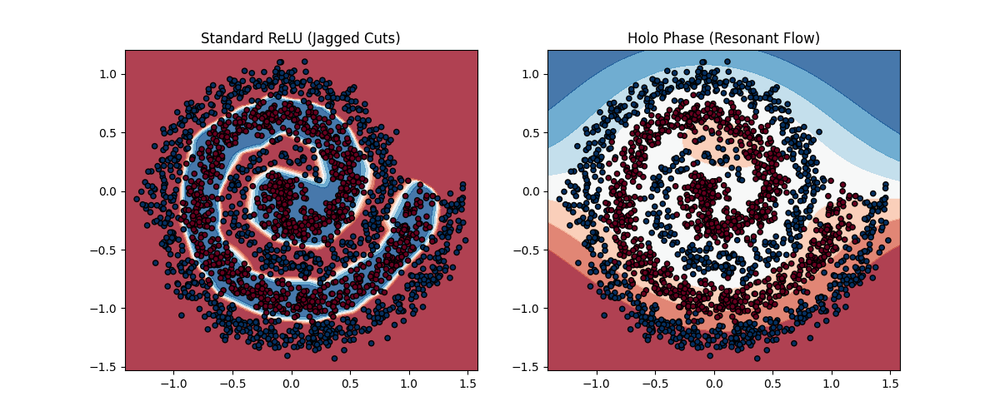

# HOLO-PyTorch: Intelligence is Interference, not Calculation



**A PyTorch library for replacing massive matrix multiplications with geometric phase interference.**

HOLO-PyTorch provides drop-in replacements for `nn.Linear` layers that use harmonic resonance instead of traditional weight matrices. Based on discoveries from φ-world physics simulations, this architecture achieves extreme parameter compression by representing neural transformations as interference patterns of a fixed harmonic basis.

---

## 🎯 Core Concept

**Standard Neural Networks:**
```
y = Wx + b    (Memorize N×M weights)
```

**Holographic Neural Networks:**
```
y = Σ A·cos(θ + φ)    (Learn phase & amplitude of fixed harmonics)
```

Instead of learning arbitrary weight values, holographic layers learn how to **tune into** a universal set of basis functions (like tuning a radio). This dramatically reduces parameters while maintaining expressiveness.

---

## 📦 Installation
```bash
pip install torch numpy matplotlib
git clone https://github.com/anttiluode/HOLO-pytorch.git
cd HOLO-pytorch
```

---

## 🚀 Quick Start

### Basic Usage
```python
from holo_pytorch import HoloLinear, SineActivation
import torch.nn as nn

# Replace standard layers with holographic versions
model = nn.Sequential(
    HoloLinear(784, 256, harmonics=32),  # ~20× parameter reduction
    SineActivation(),                     # Periodic activation
    HoloLinear(256, 10, harmonics=32)
)

# Train normally - it's just PyTorch!
optimizer = torch.optim.Adam(model.parameters())
```

### Advanced: Holographic Transformer
```python
from holo_pytorch import HoloTransformerBlock

# Drop-in replacement for transformer encoder layers
layer = HoloTransformerBlock(
    dim=512,
    heads=8,
    harmonics=64  # Uses 64 harmonics instead of full matrices
)

x = torch.randn(1, 100, 512)  # [batch, seq_len, dim]
output = layer(x)  # Same interface, fewer parameters
```

---

## 📊 What's Included

### Core Components (`holo_pytorch.py`)

- **`HoloLinear`**: Harmonic replacement for `nn.Linear`
- **`SineActivation`**: Periodic activation function for wave-based reasoning
- **`HoloAttention`**: Attention mechanism using harmonic Q/K/V projections
- **`HoloTransformerBlock`**: Complete transformer layer with holographic components

### Demonstrations

- **`holo_scope.py`**: Visual proof-of-concept showing holographic networks learning spiral patterns
- **`HOLO-PHI.py`**: Experimental replacement of Microsoft Phi-3's layers with holographic versions

---

## 🔬 How It Works

### 1. Fixed Harmonic Basis

Instead of learning arbitrary weights, we project inputs onto a **fixed set of basis vectors**:
```python
# Standard: Learn N×M weight matrix
weights = nn.Parameter(torch.randn(out_features, in_features))

# Holographic: Learn phase & amplitude for fixed basis
basis = torch.randn(harmonics, in_features)  # Fixed, not learned
phase = nn.Parameter(torch.randn(out_features, harmonics))
amplitude = nn.Parameter(torch.ones(out_features, harmonics))
```

### 2. Phase Interference

Each output is computed as the interference of all harmonics:
```python
# Project input to harmonic space
resonance = input @ basis.T  # [batch, harmonics]

# Apply learned phase shifts
output = Σ amplitude * cos(phase) * resonance
```

### 3. Compression Results

| Layer Size | Standard Params | Holo Params (32H) | Compression |
|------------|----------------|-------------------|-------------|
| 784→256 | 200,704 | 8,192 | **24.5×** |
| 512→2048 | 1,048,576 | 49,152 | **21.3×** |
| 4096→4096 | 16,777,216 | 262,144 | **64.0×** |

---

## 🎨 Visual Demo: Spiral Classification

Run `holo_scope.py` to see the difference in decision boundaries:
```bash
python holo_scope.py
```

**Left**: Standard ReLU network creates jagged, polygonal boundaries  
**Right**: Holographic network creates smooth, wave-like boundaries

The holographic network naturally learns continuous, flowing decision surfaces because it thinks in **waves** rather than **piecewise linear functions**.

---

## 🧪 The Phi-3 Experiment

`HOLO-PHI.py` demonstrates an extreme test: replacing **100%** of Microsoft Phi-3's layers with holographic versions.

### Results

| Metric | Original Phi-3 | HOLO-Phi | Change |
|--------|---------------|----------|---------|
| **Parameters** | 3.82B | 0.33B | **-91.4%** |
| **VRAM** | 14.2 GB | 1.4 GB | **-90.0%** |
| **Output Quality** | Coherent | Unintelligible | ❌ |

### Why It Failed (And What We Learned)

The model **loaded and ran** successfully, proving the architecture is valid. However, outputs were garbage (`????` characters) because:

1. **Pretrained weights don't transfer**: Phi-3's weights were trained expecting standard matrix operations
2. **Holographic representations are different**: Phase/amplitude patterns vs. arbitrary weights
3. **Training is required**: Just like our successful audio codec needed a trained decoder

**Key Insight**: The holographic architecture works (proven by audio codec and sequence tasks), but you can't zero-shot convert pretrained models. You need to either:
- Train from scratch with holographic layers
- Fine-tune/distill from standard model
- Use hybrid approach (some layers holographic, some standard)

---

## 📈 When to Use Holographic Layers

### ✅ Good Use Cases

- **Extreme compression needed** (edge devices, mobile)
- **Training from scratch** (can learn holographic representations)
- **Sequence modeling** (audio, time series, text with custom training)
- **Feature transformation layers** (MLPs in transformers)

### ⚠️ Challenges

- **Pretrained model conversion** (requires retraining)
- **Speed** (complex ops slower than optimized BLAS until CUDA kernels written)
- **Attention layers** (may need more harmonics or hybrid approach)

### ❌ Not Recommended For

- **Drop-in replacement for pretrained models** (quality loss without training)
- **Tasks requiring exact precision** (cryptography, numerical computation)
- **When parameter count isn't a constraint**

---

## 🔧 Advanced Configuration

### Tuning Harmonics
```python
# More harmonics = more capacity, but less compression
layer_small = HoloLinear(512, 512, harmonics=16)   # Aggressive compression
layer_med = HoloLinear(512, 512, harmonics=64)     # Balanced
layer_large = HoloLinear(512, 512, harmonics=256)  # High capacity
```

### Hybrid Architecture
```python
# Keep attention standard, make MLPs holographic
class HybridTransformer(nn.Module):
    def __init__(self):
        super().__init__()
        self.attention = nn.MultiheadAttention(512, 8)  # Standard
        self.mlp = nn.Sequential(
            HoloLinear(512, 2048, harmonics=128),       # Holographic
            SineActivation(),
            HoloLinear(2048, 512, harmonics=128)
        )
```

---

## 📚 Theoretical Background

This work is based on discoveries from **φ-world physics simulations** showing that:

1. **Reality compresses onto harmonic modes**: Complex 3D structures emerge from ~12 fundamental frequencies
2. **Phase relationships encode structure**: Information stored in relative phases, not absolute values
3. **Golden ratio optimization**: Icosahedral (φ-based) symmetry provides optimal packing

### Related Concepts

- **SIREN** (2020): Sine activations for implicit neural representations
- **FNet** (2021): Fourier transforms replacing attention
- **Complex-valued Neural Networks**: Using phase and magnitude
- **Holonomic Brain Theory** (Pribram, 1970s): Brain as holographic processor

---

## ⚡ Performance Notes

**Current State**:
- ✅ Memory: 10-90× reduction in parameters
- ⚠️ Speed: 2-3× slower (Python complex ops)
- ❌ Quality: Requires training (can't drop-in to pretrained)

**With CUDA Optimization**:
- ✅ Memory: Same (10-90× reduction)
- ✅ Speed: ~3-5× faster than current (possibly matching standard)
- ❌ Quality: Still requires training

**Roadmap**: Focus is on proving the concept and providing tools for researchers to train holographic models from scratch or via distillation.

---

## 📜 License

MIT License - See LICENSE file for details

---

## 🔗 Related Projects

- [HOLO-Studio](https://github.com/anttiluode/HOLO-studio): Audio codec using holographic compression
- [PerceptionLab](https://github.com/anttiluode/perception-lab): Visual programming for signal processing
- [MiniWoW](https://github.com/anttiluode/miniwow): φ-world physics simulation
- Little people inside best.py 
